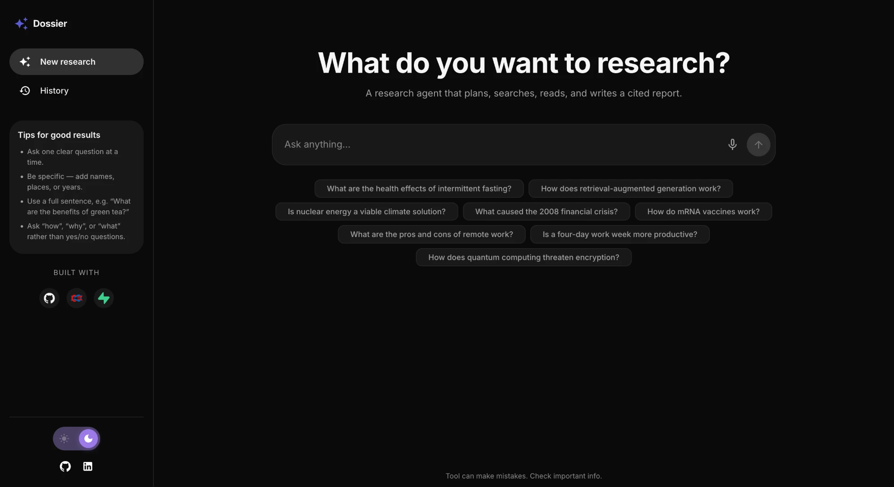
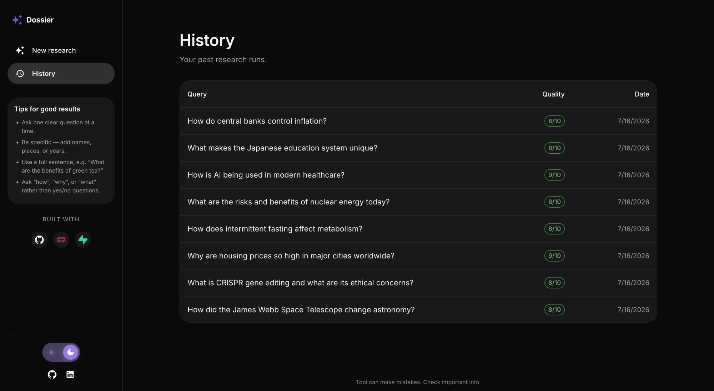
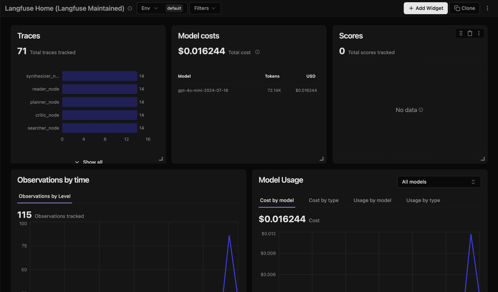
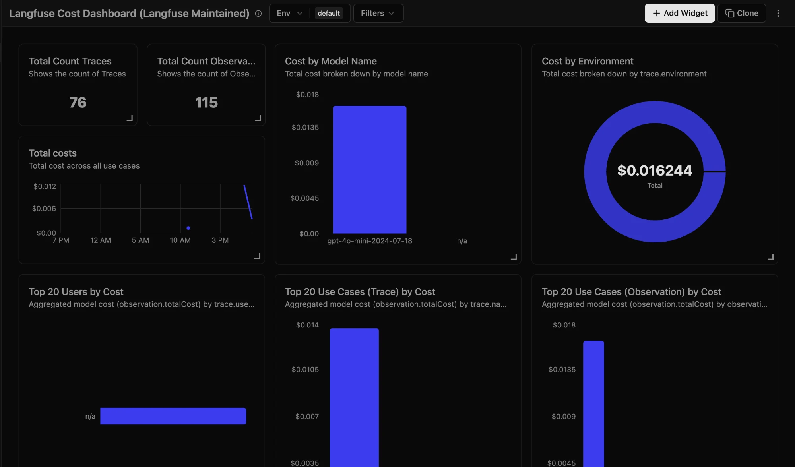
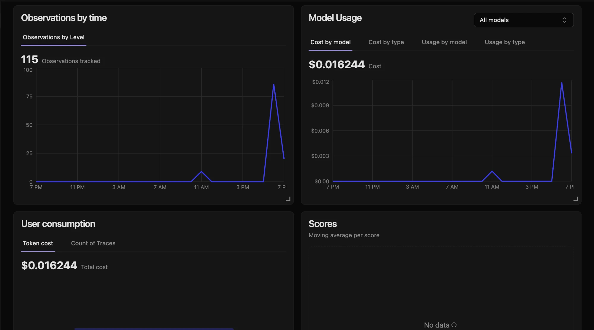

# Dossier

**An agentic AI research assistant.** Ask a question — Dossier plans it,
searches the web, reads sources, writes a cited report, and critiques its own
work before answering. Built with LangGraph.

**🔗 Deployed at: [dossier-three-woad.vercel.app](https://dossier-three-woad.vercel.app/)**
*(free-tier backend sleeps when idle — the first query after a while takes ~1
minute to wake it, then it's normal speed)*

## Screenshots

|  |  |
| --- | --- |
|  *Ask anything — the agent plans, searches, and writes* |  *Every run saved to Supabase with its quality score* |
|  *Per-node traces in Langfuse — every step observable* |  *~72K tokens across 14 full research runs ≈ $0.016 in model cost* |


*Observations and model usage over time — the afternoon spike is the 14-query batch*

## Architecture

```
                        ┌──────────────── STATE (shared dict) ────────────────┐
                        │  query · sub_questions · search_results ·           │
                        │  page_contents · report · citations · critic_score  │
                        └─────────────────────────────────────────────────────┘
                             ▲ every node reads & writes here ▼

Query → Planner → Searcher → Reader → Synthesizer → Critic → Report
                    ↑_______________________________|
                         (loops back if weak)
```

- **Planner** – splits the question into 3–5 sub-questions
- **Searcher** – runs a web search for each sub-question (DuckDuckGo)
- **Reader** – fetches the top pages and extracts their main text (trafilatura)
- **Synthesizer** – writes a structured report with inline `[n]` citations
- **Critic** – scores the report 0–10; loops back to the planner if it's weak
  (max 2 passes)

## Tools & why

All managed services — no Docker, nothing to self-host.

| Tool | What it does here | Why |
| ---- | ----------------- | --- |
| **LangGraph + LangChain** | Orchestrates the agent as a graph of nodes with a self-critique loop | The loop (critic → planner) needs branching and state a plain script can't express cleanly |
| **GitHub Models** | LLM inference (`gpt-4o-mini`, OpenAI-compatible endpoint) | Free tier, no separate billing setup — good for a portfolio project |
| **Langfuse** | Traces every node; captures token usage and latency per step | Makes the agent observable — you can see *why* a run scored low, per node |
| **Supabase (Postgres)** | Persists every research run; powers the History view | Managed Postgres with a simple client and a generous free tier |
| **FastAPI** | Wraps the agent in a REST API (`/research`, `/runs`) | Minimal, typed, auto-generated `/docs` |
| **Next.js + MUI v5** | Frontend — sidebar, history, light/dark theming | App Router + a mature component library, no custom CSS framework |
| **Render** | Hosts the FastAPI backend | Runs Python web services straight from the repo, free tier, no Docker |
| **Vercel** | Hosts the Next.js frontend | Built for Next.js — zero-config deploys from the repo, free tier |

## Environment variables

| Variable                       | Needed in | Purpose                                 |
| ------------------------------ | --------- | --------------------------------------- |
| `GITHUB_TOKEN`                 | now       | Auth for GitHub Models (the LLM)        |
| `GITHUB_MODEL`                 | optional  | Model name (default `gpt-4o-mini`)      |
| `GITHUB_MODELS_BASE_URL`       | optional  | GitHub Models endpoint URL              |
| `FRONTEND_ORIGINS`             | on deploy | CORS allow-list (default `localhost:3000`; set to Vercel URL in prod) |
| `LANGFUSE_PUBLIC_KEY` / `_SECRET_KEY` | optional | Tracing (nodes run untraced without it) |
| `SUPABASE_URL` / `_KEY`        | optional  | Persisting research runs (run `schema.sql` once) |

Supabase degrades gracefully — leave it blank and the agent still runs, just
without saving to History.

Frontend (`frontend/.env.local`): `NEXT_PUBLIC_API_URL` plus
`NEXT_PUBLIC_GITHUB_URL` / `NEXT_PUBLIC_LINKEDIN_URL` for the sidebar links.

## Running

- **Everything at once (dev):** `npm run dev` from the repo root — starts the
  API and the Next.js frontend together.
- **Agent only (CLI):** `python -m agent.graph "<question>"`
- **API only:** `python -m uvicorn main:app --reload` — docs at `/docs`

## API endpoints

| Method | Path          | Description                                        |
| ------ | ------------- | -------------------------------------------------- |
| `POST` | `/research`   | Run the agent, save the run, return the report      |
| `GET`  | `/runs`       | List past runs, newest first                       |
| `GET`  | `/runs/{id}`  | Get one full past run                              |

`/research` returns `id`, `query`, `report` (markdown), `citations` (list of
URLs), and `critic_score` (0–10).

## Intro to LangGraph (my notes)

LangGraph builds an agent as a **graph**: small steps (**nodes**) connected by
**edges** that decide what runs next. A shared **state** object flows through
the whole graph — each node reads it and returns the fields it wants to update.

The four pieces:

1. **State** — a `TypedDict` (`ResearchState`) that every node shares. A node
   returns only the keys it changed; LangGraph merges them in.
2. **Nodes** — plain functions `state -> dict`. The five `*_node` functions.
3. **Edges** — the wiring:
   - normal edge: always go A → B (`add_edge`)
   - conditional edge: a function returns the *name* of the next node, which is
     how we loop `critic → planner` or finish `critic → END`
     (`add_conditional_edges`)
4. **Compile & run** — `graph = builder.compile()`, then
   `graph.invoke({"query": ...})` runs `START → … → END` and returns the final
   state.

**Why a graph and not a plain list of steps?** A list only goes forward. Our
critic **loops back** to the planner, so the flow isn't linear — and a graph is
the structure that naturally handles loops and branches. It also means every
step is a named checkpoint (good for tracing) and nodes stay decoupled (they
only touch shared state, never call each other), so the flow can be rewired
without rewriting the nodes.

The pattern is reusable beyond research: **decompose → gather → synthesize →
self-critique with a bounded retry loop**. The node *names* are specific to this
use case; the shape generalizes.
```
StateGraph(schema) → add_node / add_edge → compile() → invoke(state)
   define shape         wire the flow        make runnable    run it
```
